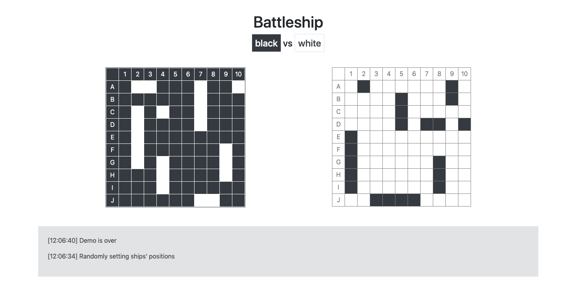

# Battleship demo
Battleship computer vs computer using Go

This is very simple demo to show my current Go knowledge. 

Currently supported:
- boards creation
- choosing position for all ships for both armies
- sequential fires from one army to the other
- sound effects

Go knowledge I used in this demo:
- variables, constants, types
- slices
- arrays
- packages
- structures
- pointers
- pseudo-object-methods
- imports, including remote
- loops, conditions, switches, functions
- go html templates
- conditions, loops in templates
- subtemplates
- basic web server with two commands and static content
- session handling
- json

To run the demo type ```go build battleship.go```

That demo should be accessed via ```http://localhost``` 
at standard port 80 (application tries to find free one from 80 to 89 - follow console messages). 